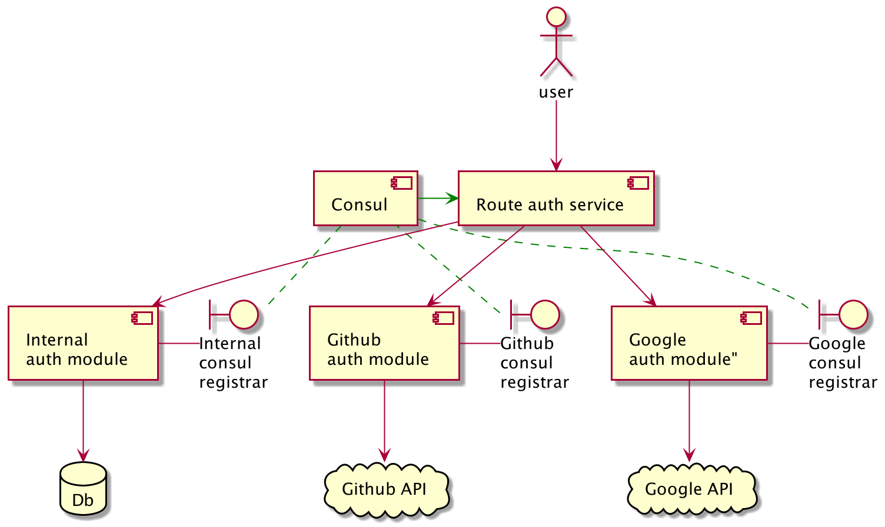

# Router Auth Authentication service

This is a routing service to authenticate users via OAuth and use it as an authentication middleware in a bundle with Traefik

[Traefik setup](https://doc.traefik.io/traefik/v1.7/configuration/backends/kubernetes/#authentication)

## Flow

## Projects used

- Inner auth: https://github.com/j0rsa/jwt-auth
- Github oAuth: https://github.com/j0rsa/github-oauth-service
- Google oAuth: https://github.com/j0rsa/google-oauth-service
- Consul registrar: https://github.com/j0rsa/consul-registrar

## Endpoints
| Method |     URL         | Description |
| ------:| --------------- | ----------- |
| `GET`  | `/health`       | Healthcheck which returns Code 200 |
| `GET`  | `/health/{provider}`       | Dependant Healthcheck for auth service |
| `GET`  | `/providers`    | Return registered providers |
| `GET`  | `/auth/login/{provider}`   | Redirect to login page with required scopes for provided client id |
| `POST` | `/auth/token?provider={provider}`   | Get JWT token by passing user code `{ "code": "<code>"}` after auth |
| `GET`  | `/auth/check`   | Checks the token and returns code 200 with Headers: `X-Auth-Id` with user id, `X-Auth-User` |
| `POST` | `/auth/refresh` | Refresh token with a new one by passing the old valid one `{ "token": "eyJhbGciOiJIUz..." }` |

## Environment variables
| Variable | Default value | Description |
| ------| --- | ----------- |
| RUST_LOG | info | defines the log level of app |
| BIND_ADDRESS | 0.0.0.0 | Address of web server to listen connections |
| BIND_PORT | 8080 | Port of web server to listen connections |
| CONSUL_URL | http://localhost:8500 | Url to consul for service discovery |
| CONSUL_SERVICE | auth | Service name to search for instances |
# Build

## Build release locally
    cargo build --release

## Build release in docker and prepare an image
    docker build -t j0rsa/route-auth-service .
    